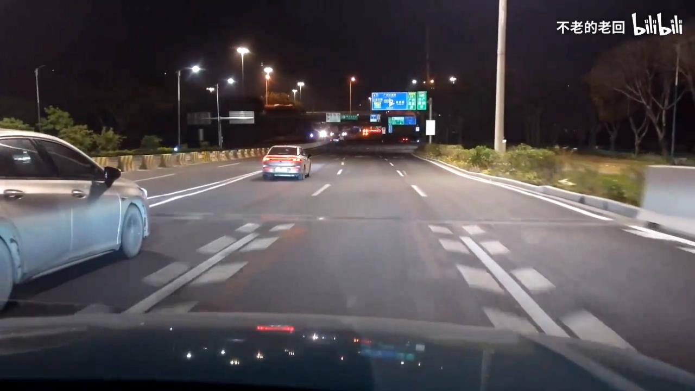
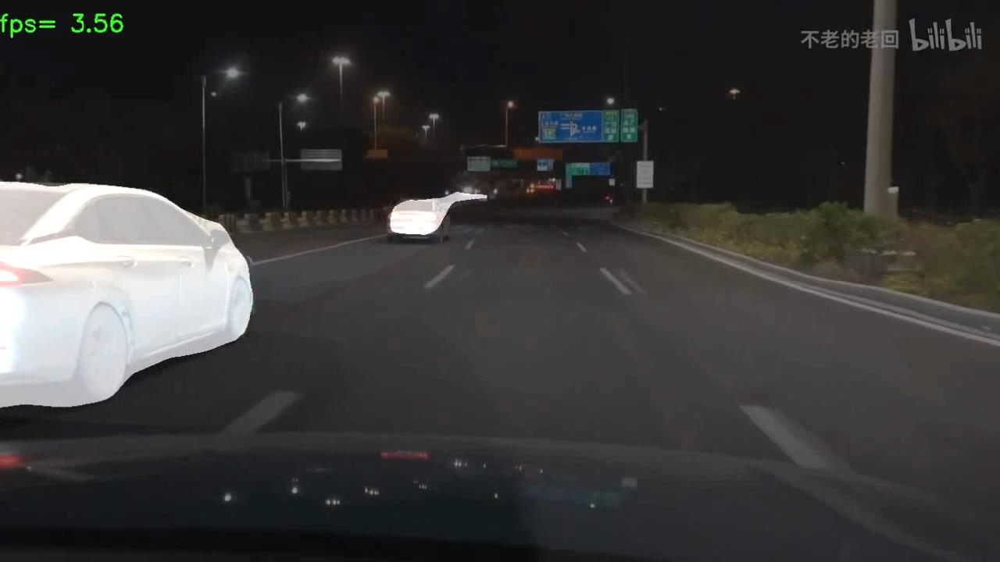

# DeepLabv3+：Encoder-Decoder with Atrous Separable Convolution

## 该项目主要是来自
* https://github.com/bubbliiiing/deeplabv3-plus-pytorch

### 所需环境
torch==1.2.0

### 注意事项
代码中的deeplab_mobilenetv2.pth和deeplab_xception.pth是基于VOC拓展数据集训练的。训练和预测时注意修改backbone。    

### 文件下载
训练所需的deeplab_mobilenetv2.pth和deeplab_xception.pth可在百度网盘中下载。     
链接：https://pan.baidu.com/s/1oBhjnIzqN_u86OIR5PyZEA?pwd=3jqx 
提取码：3jqx 


### 预测步骤
下载完库后解压，如果想用backbone为mobilenet的进行预测，直接运行predict.py就可以了；如果想要利用backbone为xception的进行预测，在百度网盘下载deeplab_xception.pth，放入model_data，修改deeplab.py的backbone和model_path之后再运行predict.py。 
在predict.py文件中修改
```python
mode = "video"
```
将网盘文件中的test.mp4文件放入项目根目录，然后在predict.py文件中修改
```python
video_path      = "test.mp4"
video_save_path = "test_1.mp4"
```
运行predict.py，即可得到预测结果。   

### 效果展示
原视频截图
 
测试结果截图

 

